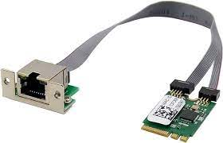
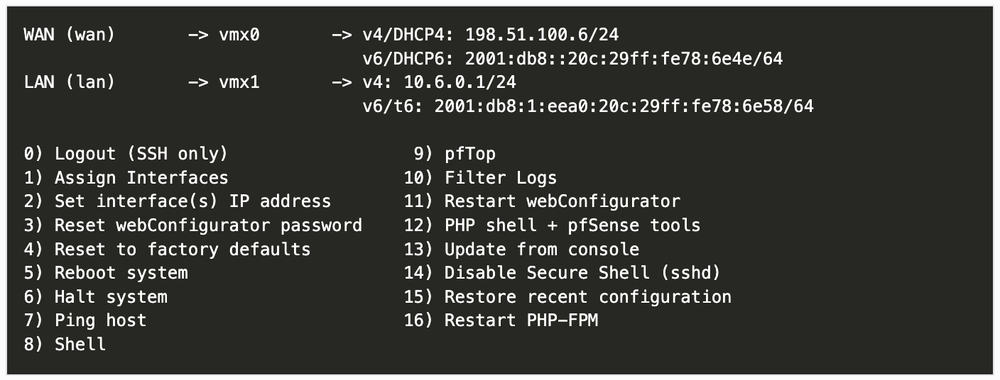

# pfSense router/firewall on HP T630 Thin Client under $25

## HP T630 Thin Client (relevant) Specs:

- CPU: AMD GX-420GI
- Power Consumption: 12W idle, 28W running
- Cooling: 100% passive
- Ports: Detachable VGA port
- Integrated NIC: 1Gigabit
- Additional NIC: M.2 E A Key 2.5 Gigabit RJ45 LAN Realtek RTL8125B


  
  Learn more about T630 from [Parky Towers](https://www.parkytowers.me.uk/thin/hp/t630/)

## Reasons for Choosing HP T630:

1. Cost-effective: Purchased brand new for $14.99 on eBay.
2. Compact size and low power consumption.
3. CPU supports AES-NI, ideal for pfSense.
4. 100% Passive cooling for silent operation.
5. Compatible with additional NIC for LAN connectivity.
6. Suitable for my home network with a 1Gig internet connection.

## NIC Selection:

1. Since the T630 is a thin client, it has limitations on compatible NICs.
2. With no PCIe slot available and a preference for a clean setup without exposed wires.
3. The T630's M.2 2230 slot, typically used for WiFi cards, became the focus.
4. After thorough online research, [confirmaed](https://www.miccet.nl/2023/01/11/extra-nic-on-the-hp-thin-client-t630/) that the Realtek RTL8125B is compatible with the T630, available on AliExpress for $7.
5. Opting for a 2.5 Gigabit NIC proved optimal for my home network, aligning with plans to utilize a managed 2.5Gb switch for network segmentation between home, guest, and IoT devices.





## NIC Installation:

1. Removed the detachable VGA port from the thin client and replaced with the NIC.
3. Utilized integrated 1Gigabit ethernet port for WAN and 2.5G port for LAN.

## pfSense Installation:


1. Imaged [pfSense](https://www.pfsense.org/download/) on a flash drive with [Etcher](https://etcher.balena.io/).
2. Realtek RTL8125 NIC not detected initially.
3. Completed initial setup with one 1Gigabit NIC for WAN.
4. Accessed pfSense console menu and entered shell (option 8).
5. Installed Realtek driver using the following command:

```
pkg add net/realtek-re-kmod

```
6. Modified `/boot/loader.conf` file to load Realtek driver on boot:
```
if_re_load="YES"
if_re_name="/boot/modules/if_re.ko"
```
7. Rebooted the machine and assigned interfaces again from the console menu (option 1).

## Conclusion:

With the installation of pfSense on the HP T630 thin client and the additional Realtek NIC, a robust and efficient home network setup was achieved, providing reliable WAN and LAN connectivity.
