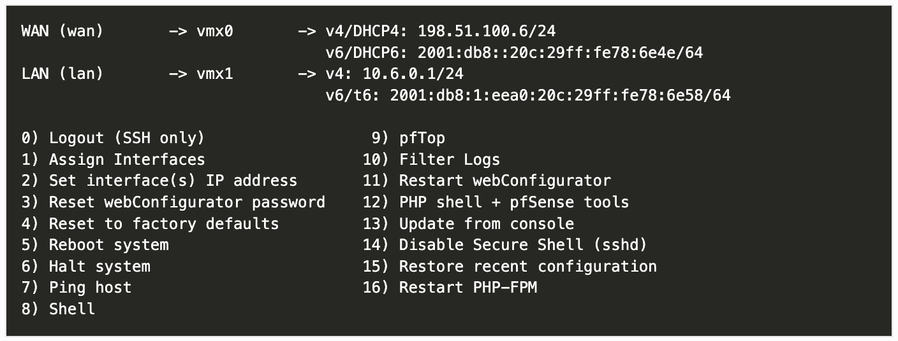

# Building a Perfect pfSense Router under $25 with HP T630 Thin Client + 2.5Gb Intel NIC

This guide details how to build a cost-effective, energy-efficient pfSense router/firewall using an HP T630 Thin Client. The total build cost is under $25, making it an excellent option for home networking enthusiasts.
> For a better experience, follow [this guide on my website](https://shawon.me/posts/pfsence-router-under-25-hp-t630-thin-client/).

## Hardware Requirements

### Base System: HP T630 Thin Client
- **CPU**: AMD GX-420GI (with AES-NI support)
- **Power Consumption**: 12W idle, 28W under load
- **Cooling**: Passive (fanless)
- **Integrated NIC**: 1 Gigabit Ethernet
- **Expansion**: M.2 E A Key slot
- **Cost**: ~$15 (eBay, brand new)


*For detailed specifications, visit [Parky Towers T630 Documentation](https://www.parkytowers.me.uk/thin/hp/t630/)*

### Additional Network Interface
- **Model**: Realtek RTL8125B
- **Speed**: 2.5 Gigabit Ethernet
- **Form Factor**: M.2 2230 (E A Key)
- **Cost**: ~$7-9 ([AliExpress Link](https://www.aliexpress.us/item/3256804497025928.html))


## Hardware Assembly

1. **NIC Installation**
   - Remove the detachable VGA port from the thin client
   - Install the M.2 NIC in the vacated slot
   - No additional modifications required

2. **Network Configuration**
   - Integrated 1GB NIC → WAN connection
   - RTL8125B 2.5GB NIC → LAN connection

## Software Installation

### Prerequisites
- [pfSense ISO](https://www.pfsense.org/download/)
- [Etcher](https://etcher.balena.io/) or similar USB writing tool
- USB drive (minimum 8GB)

### Installation Steps

1. **Create Installation Media**
   - Download pfSense installation image
   - Write image to USB drive using Etcher
   - Boot T630 from USB drive

2. **Initial Setup**
   - Complete basic pfSense installation
   - Note: RTL8125B NIC won't be detected initially
   - Configure WAN interface using integrated NIC

3. **RTL8125B Driver Installation**
   - Access pfSense console (Option 8 for shell)
   - Install Realtek driver:
   ```bash
   pkg add net/realtek-re-kmod
   ```
   - Configure driver autoload by adding to `/boot/loader.conf`:
   ```bash
   if_re_load="YES"
   if_re_name="/boot/modules/if_re.ko"
   ```
   - Reboot system
   - Assign interfaces (Option 1 in console menu)

## Why This Build?

### Advantages
- **Cost-Effective**: Complete build under $25
- **Energy Efficient**: Low power consumption (12-28W)
- **Silent Operation**: Fanless design
- **Performance**: AES-NI support for VPN capabilities
- **Expandability**: 2.5GB LAN for future-proofing
- **Compact**: Small form factor

### Use Cases
- Home network routing
- Network segmentation (Home/Guest/IoT)
- Basic firewall implementation
- VPN server capabilities

## Performance Considerations

This build is suitable for:
- Internet connections up to 1Gbps
- Multiple VLANs
- Basic to moderate VPN usage
- Small to medium home networks



## Additional Resources
- [pfSense Documentation](https://docs.netgate.com/pfsense/en/latest/)
- [HP T630 Technical Details](https://www.parkytowers.me.uk/thin/hp/t630/)
- [RTL8125B Compatibility Reference](https://www.miccet.nl/2023/01/11/extra-nic-on-the-hp-thin-client-t630/)

## Conclusion

This build provides an excellent balance of cost, performance, and efficiency for home networking needs. The HP T630 with added RTL8125B NIC creates a capable pfSense router suitable for most home networking scenarios, all while maintaining a budget under $25.
